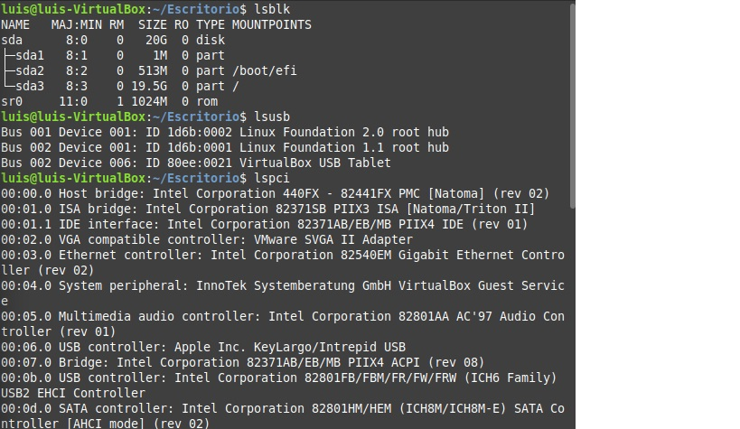
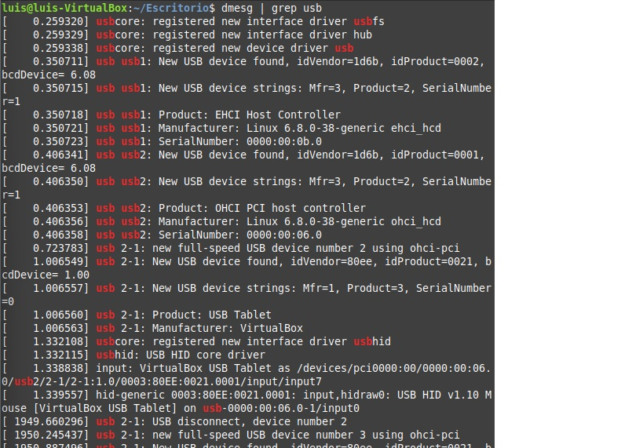
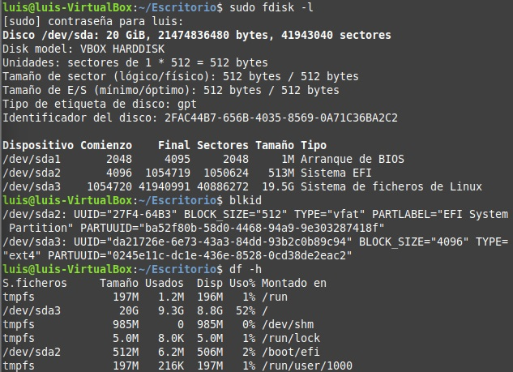
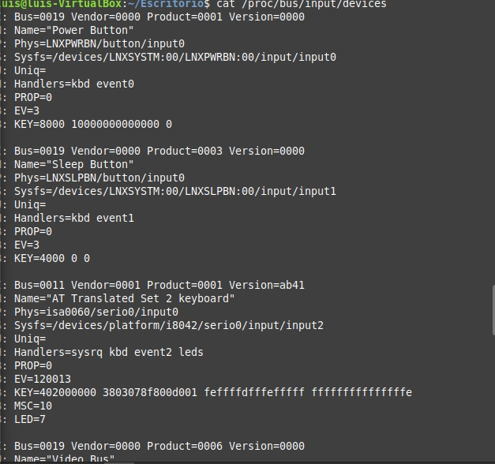
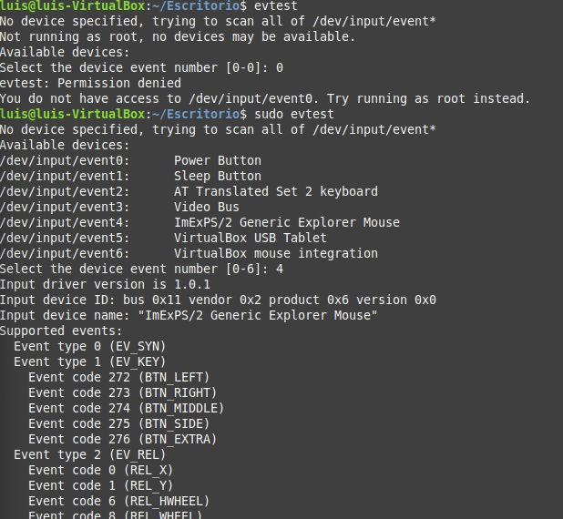
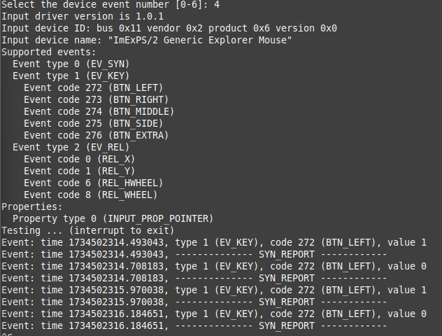

# ACTIVIDAD 1: listar dispositivos conectados

## ¿Qué tipos de dispositivos se muestran en la salida de "lsblk"?
* Se muestran todos los dispositivos de almacenamiento

## ¿Cuál es la diferencia entre "lsusb" y "lspci"?
* Qué "lsusb" muestra únicamente la descripción de los puertos de entrada USB que tiene el equipo, mientras que "lspci" muestra la descripción de todos los puertos de entrada de cualquier periférico (audio, video, red, etc).

## ¿Qué información adicional proporciona "dmesg | grep usb"?
* Nos muestra además de la descripción de los puertos, nos muestra características más específicas como el fabricante, la tecnología que usa, numero de serie entre otros.

# ACTIVIDAD 2: Verificar dispositivos de almacenamiento.

## ¿Qué dispositivos de almacenamiento están conectados a su sistema?
* Al ser una máquina virtual, se muestra conectado el disco duro únicamente

## ¿Qué particiones están montadas actualmente?
* sda2 (sistema de EFI)
* sda3 (sistema de ficheros Linux)

## ¿Qué tipo de sistemas de archivos se usan en las particiones)
* Para sda2 se utiliza "Vfat"
* para sda3 se utiliza "ext4"

# ACTIVIDAD 3: Explorar dispositivos de entrada

