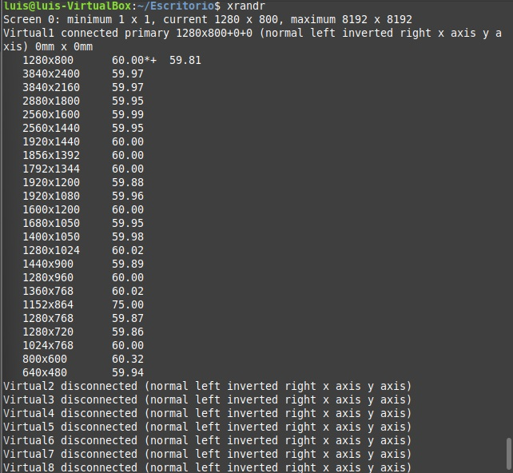
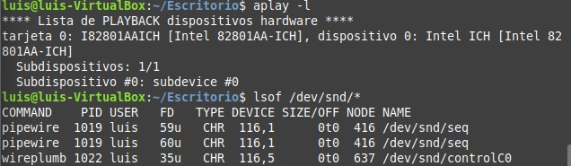

# ACTIVIDAD 1: listar dispositivos conectados

## ¿Qué tipos de dispositivos se muestran en la salida de "lsblk"?
* Se muestran todos los dispositivos de almacenamiento

## ¿Cuál es la diferencia entre "lsusb" y "lspci"?
* Qué "lsusb" muestra únicamente la descripción de los puertos de entrada USB que tiene el equipo, mientras que "lspci" muestra la descripción de todos los puertos de entrada de cualquier periférico (audio, video, red, etc).

## ¿Qué información adicional proporciona "dmesg | grep usb"?
* Nos muestra además de la descripción de los puertos, nos muestra características más específicas como el fabricante, la tecnología que usa, numero de serie entre otros.

# ACTIVIDAD 2: Verificar dispositivos de almacenamiento.

## ¿Qué dispositivos de almacenamiento están conectados a su sistema?
* Al ser una máquina virtual, se muestra conectado el disco duro únicamente

## ¿Qué particiones están montadas actualmente?
* sda2 (sistema de EFI)
* sda3 (sistema de ficheros Linux)

## ¿Qué tipo de sistemas de archivos se usan en las particiones)
* Para sda2 se utiliza "Vfat"
* para sda3 se utiliza "ext4"

# ACTIVIDAD 3: Explorar dispositivos de entrada

## ¿Qué eventos genera cada dispositivo al interactuar con ellos?
* Mouse: EV_SYN, EV_KEY, EV_REL
* Teclado: EV_SYN, EV_KEY, EV_MSC, EV_LED
* USB: EV_ABS, EV_SYN, EV_KEY, EV_REL

## ¿Cómo se identifican los dispositivos en "/proc/bus/input/devices"?
* Se identifican mediante un nombre asignado por el sistema, además de información como el bus, el vendedor, el producto y la versión.

# ACTIVIDAD 4: Examinar dispositivos de salida.

## ¿Qué salidas de video están disponibles en su sistema?
Solo la pantalla principal de mi laptop, además de una lista de salidas enumeradas de la 2 a la 8 proporcionadas por la máquina virtual.

## ¿Qué dispositivos de sonido se detectaron?
Solo la tarjeta base intel de mi laptop

## ¿Qué procesos están usando la tarjeta de sonido?
Los procesos "pipewire" y "wireplumb".

# ACTIVIDAD 5: Crear un script de resumen.

## ¿Qué ventajas tiene usar un script para recopilar esta información?
* Que toda la información puede ser mostrada con una sola ejecución, además de ser presentada de manera mas ordenada visualmente hablando

## ¿Qué cambios realizaría para personalizar el script?
Tal vez agregar que también recopile información de las redes disponibles o al menos información de la red a la que se está conectado.

# ACTIVIDAD 6: Reflexión y discusión.

## ¿Qué comando encontró más útil y por qué?
* El de "evtest" ya que puede ser utilizado para comprobar alguna falla existente en nuestros perifericos, por ejemplo que una tecla del teclado no funcione o algo por el estilo

## ¿Qué tan importante es conocer los dispositivos conectados al sistema?
* Muy importante ya que de esta manera podemos saber reconocer a donde ir (que dispositivo) en caso de que se presente alguna falla o se quiera realizar algo como un programa que requiera cierta acción o uso de algún dispositivo en específico.

## ¿Cómo podrían estos conocimientos aplicarse en la administración de sistemas?
* Para poder identificar cuales son los dispositivos con los que cuenta cada equipo y así poder tener un control de las actividades que se pueden hacer en el mismo.
* 
